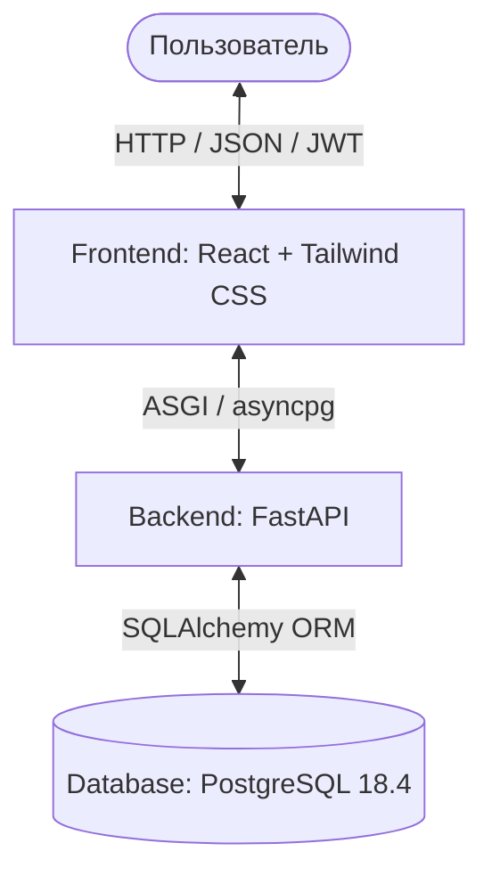
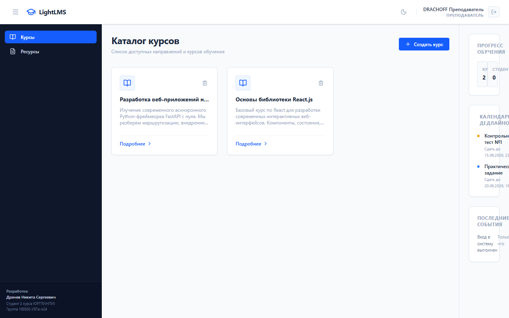
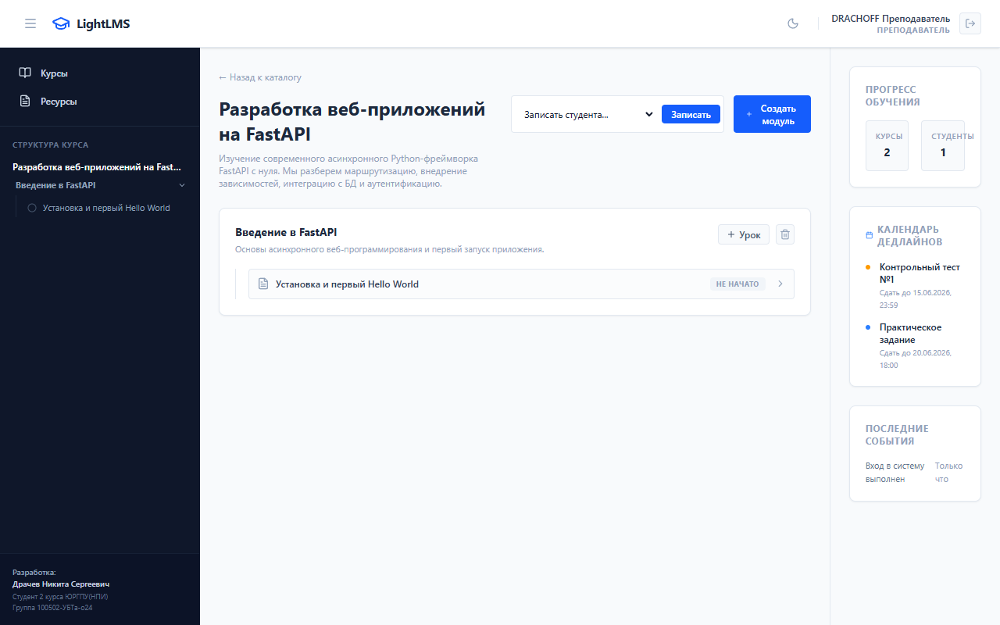
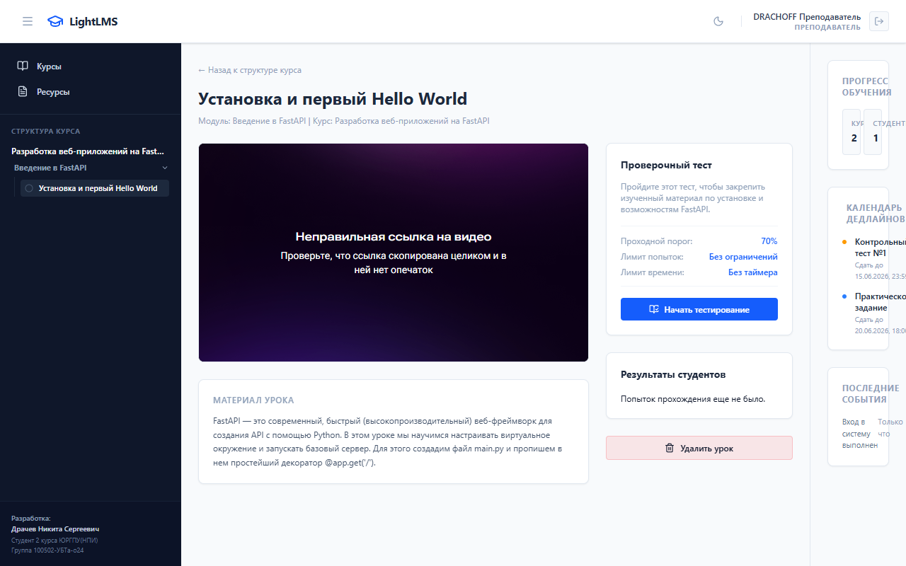
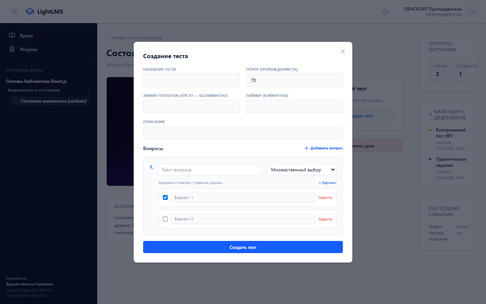
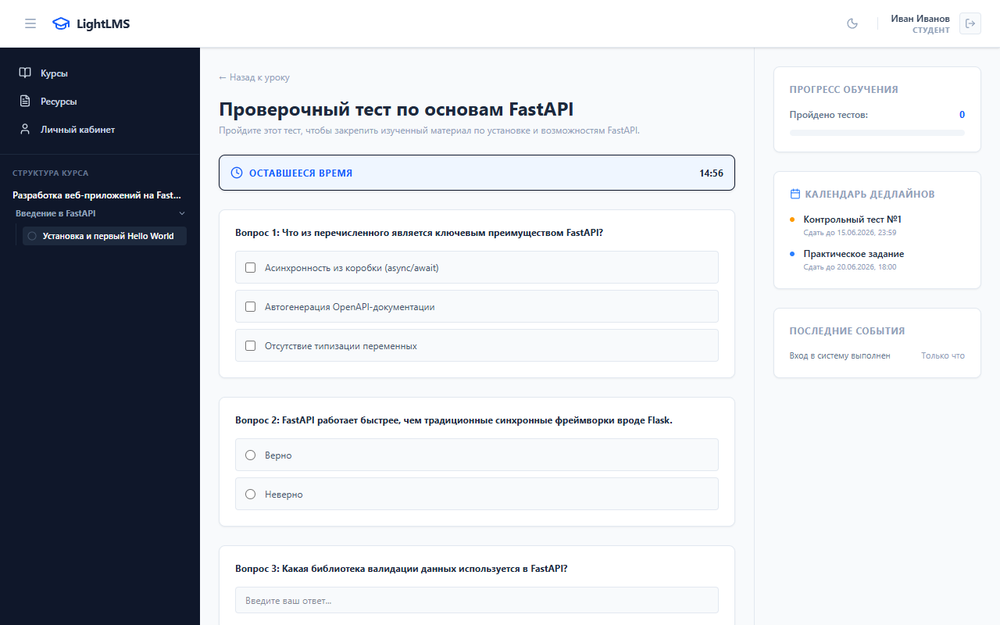
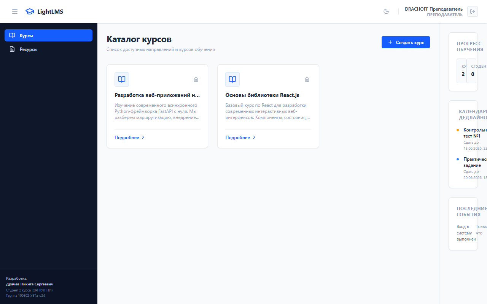

# Отчет по разработке системы СДО LightLMS

  Разработано: <strong>Драчевым Никитой Сергеевичем</strong> 
  Студентом 2 курса ЮРГПУ(НПИ) г.Новочеркасск, группы 100502-УБТа-о24

Данный документ содержит полное описание архитектуры, функциональных возможностей, используемого программного обеспечения (ПО) и процедур тестирования для Системы Дистанционного Обучения **LightLMS**.

---

## 1. Архитектура системы

Система построена по классической многослойной схеме разделения фронтенда (React) и бэкенда (FastAPI) с использованием реляционной СУБД PostgreSQL.

### Основные компоненты бэкенда:
- **FastAPI Router**: Маршрутизация HTTP-запросов (`/api/v1/auth`, `/api/v1/courses`, `/api/v1/lessons`, `/api/v1/tests`, `/api/v1/resources`, `/api/v1/users`).
- **SQLAlchemy ORM**: Двунаправленное асинхронное сопоставление сущностей базы данных.
- **Pydantic**: Валидация входных данных, фильтрация ответов сериализации и управление конфигурацией среды.
- **JWT-based Security**: Безопасный обмен учетными токенами с шифрованием `HS256` и хэшированием паролей через `bcrypt`.

---

## 2. Спецификация программного обеспечения и версий

Ниже представлены списки основных библиотек и версий ПО, используемых в проекте.

### Системное ПО
| Компонент | Версия | Описание / Назначение |
| :--- | :--- | :--- |
| **Python** | `3.12.x` | Язык программирования бэкенда |
| **Node.js** | `>=18.x` | Среда выполнения фронтенда |
| **PostgreSQL** | `18.4` | Реляционная база данных для хранения информации |

### Зависимости Бэкенда (`backend/requirements.txt`)
| Пакет | Версия | Описание |
| :--- | :--- | :--- |
| `fastapi` | `>=0.110.0` | Веб-фреймворк для создания REST API |
| `uvicorn` | `>=0.28.0` | Веб-сервер ASGI для запуска приложения |
| `sqlalchemy` | `>=2.0.28` | ORM для работы с БД |
| `asyncpg` | `>=0.29.0` | Асинхронный драйвер PostgreSQL |
| `pydantic-settings` | `>=2.2.1` | Валидация конфигурационных файлов через Pydantic |
| `bcrypt` | `>=4.0.0` | Библиотека хэширования паролей пользователей |
| `python-jose` | `>=3.3.0` | Создание и проверка токенов авторизации JWT |
| `aiosqlite` | `>=0.20.0` | Драйвер SQLite для изолированного модульного тестирования |

### Зависимости Фронтенда (`frontend/package.json`)
| Пакет | Версия | Описание |
| :--- | :--- | :--- |
| `react` | `^19.2.6` | Основная UI-библиотека интерфейса |
| `vite` | `^8.0.12` | Быстрый сборщик и сервер разработки |
| `tailwindcss` | `^4.3.0` | Утилитарный CSS-фреймворк |
| `lucide-react` | `^1.17.0` | Библиотека векторных иконок интерфейса |
| `postcss` | `^8.5.15` | Обработчик стилей CSS |

---

## 3. Функциональные модули системы

### 1. Безопасность и управление учетными записями
- **Авторизация**: Реализована авторизация по протоколу OAuth2 (Bearer Token с JWT).
- **Сложность паролей**: Проверка паролей при регистрации регулярными выражениями (не менее 8 символов, минимум одна заглавная буква, одна строчная буква, цифра и специальный символ).
- **Ролевая модель**: Три встроенные роли пользователей:
  - `admin` (Администратор) — полный доступ ко всем курсам, пользователям, урокам, ресурсам.
  - `teacher` (Преподаватель) — создание курсов, управление модулями/уроками/тестами своих курсов, ручная оценка эссе, зачисление студентов.
  - `student` (Студент) — просмотр зачисленных курсов, прохождение тестов, скачивание ресурсов.

### 2. Управление обучением (LMS)
- **Каталог курсов**: Гибкая сетка курсов со списком модулей и вложенных уроков.
- **Запись на курсы**: Закрытая модель саморегистрации студентов — запись осуществляется только преподавателем/администратором.
- **Поддержка медиа**: Уроки поддерживают текстовый контент Markdown и автоматическое встраивание видео через плееры **Rutube** и **YouTube**.
- **База ресурсов**: Общее хранилище дополнительных материалов, доступное всем участникам.

### 3. Модуль тестирования (Moodle-стиль)
- **Типы вопросов**:
  1. `multiple_choice` — Множественный выбор с несколькими ответами.
  2. `true_false` — Верно/Неверно.
  3. `short_answer` — Короткий текстовый ответ.
  4. `numerical` — Числовой ввод с погрешностью (tolerance).
  5. `matching` — На соответствие пар.
  6. `essay` — Эссе (требует ручной проверки и оценивания преподавателем).
  7. `select_missing_words` — Выбор пропущенных слов.
- **Контроль списывания**: Перемешивание вариантов ответов, сокрытие правильных ключей на уровне API для студентов.
- **Ограничения**: Лимит попыток (`max_attempts`) и таймер обратного отсчета (`timer_minutes`) с автоотправкой результатов по истечении времени.

---

## 4. Дизайн-система интерфейса

Интерфейс спроектирован в соответствии с концепцией минималистичной модульной сетки:
- **Шрифт**: Системный шрифт `Inter` с четкой иерархией размеров.
- **Структура**:
  - Левая колонка: сворачиваемая древовидная навигация по структуре курса.
  - Центральная колонка: рабочая зона (карточки с выраженными границами без эффекта размытия).
  - Правая колонка: виджеты успеваемости, дедлайнов и событий.
- **Темная/Светлая тема**: Реализован ручной переключатель тем в шапке с сохранением выбора в `localStorage` и изоляцией классов через `@custom-variant dark`.

---

## 5. Галерея экранов системы

> [!NOTE]
> Все изображения демонстрируют реальное состояние веб-приложения LightLMS.

### Общий вид каталога курсов (Светлая тема)

### Структура курса и древовидная навигация (Светлая тема)

### Страница урока с Rutube видеоплеером (Темная тема)

### Конструктор тестов с расширенными вопросами (Темная тема)

### Прохождение тестирования студентом (Темная тема)

### Панель результатов и ручной оценки эссе (Темная тема)

---

## 6. Тестирование и верификация

Все основные модули системы покрыты автоматическими тестами.

1. **Регистрация и JWT-сессии** (`test_auth.py`):
   - Запуск: `python test_auth.py`
   - Проверяет создание пользователей со сложными паролями, валидацию пароля, а также генерацию и декодирование JWT токенов авторизации.
2. **Управление курсами** (`test_courses.py`):
   - Запуск: `python test_courses.py`
   - Проверяет древовидное создание цепочки Курс -> Модуль -> Урок, а также процедуру зачисления студента.
3. **Модуль тестов** (`test_tests.py`):
   - Запуск: `python test_tests.py`
   - Проверяет правильность начисления баллов за новые типы вопросов (matching, numerical, short_answer) и процесс ручного переопределения оценок.
